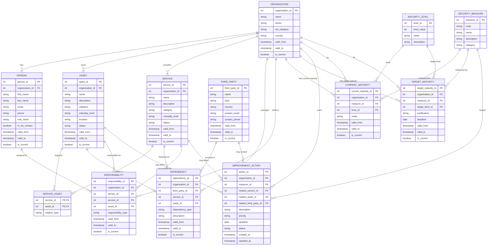

```mermaid
erDiagram

    ORGANIZATION {
        int organization_id PK
        string name
        string sector
        string nis_category
        string country
        timestamp valid_from
        timestamp valid_to
        boolean is_current
    }

    PERSON {
        int person_id PK
        int organization_id FK
        string first_name
        string last_name
        string email
        string phone
        string role_name
        boolean is_nis_contact
        timestamp valid_from
        timestamp valid_to
        boolean is_current
    }

    ASSET {
        int asset_id PK
        int organization_id FK
        string name
        string description
        string category
        string criticality_level
        string location
        string status
        timestamp valid_from
        timestamp valid_to
        boolean is_current
    }

    SERVICE {
        int service_id PK
        int organization_id FK
        string name
        string description
        string category
        string criticality_level
        string status
        timestamp valid_from
        timestamp valid_to
        boolean is_current
    }

    THIRD_PARTY {
        int third_party_id PK
        string name
        string type
        string country
        string contact_email
        string contact_phone
        timestamp valid_from
        timestamp valid_to
        boolean is_current
    }

    SERVICE_ASSET {
        int service_id PK, FK
        int asset_id PK, FK
        string relation_type
    }

    DEPENDENCY {
        int dependency_id PK
        int organization_id FK
        int third_party_id FK
        int service_id FK
        int asset_id FK
        string dependency_type
        string description
        timestamp valid_from
        timestamp valid_to
        boolean is_current
    }

    RESPONSIBILITY {
        int responsibility_id PK
        int organization_id FK
        int person_id FK
        int service_id FK
        int asset_id FK
        string responsibility_type
        timestamp valid_from
        timestamp valid_to
        boolean is_current
    }

    SECURITY_MEASURE {
        int measure_id PK
        string code
        string name
        string description
        string category
    }

    MATURITY_LEVEL {
        int level_id PK
        int level_value
        string name
        string description
    }

    CURRENT_MATURITY {
        int current_maturity_id PK
        int organization_id FK
        int measure_id FK
        int level_id FK
        string notes
        timestamp valid_from
        timestamp valid_to
        boolean is_current
    }

    TARGET_MATURITY {
        int target_maturity_id PK
        int organization_id FK
        int measure_id FK
        int target_level_id FK
        string justification
        date deadline
        timestamp valid_from
        timestamp valid_to
        boolean is_current
    }

    IMPROVEMENT_ACTION {
        int action_id PK
        int organization_id FK
        int measure_id FK
        int related_service_id FK
        int related_asset_id FK
        int related_third_party_id FK
        string description
        string priority
        date deadline
        string status
        timestamp created_at
        timestamp updated_at
    }

    ORGANIZATION ||--o{ PERSON : "has"
    ORGANIZATION ||--o{ ASSET : "owns"
    ORGANIZATION ||--o{ SERVICE : "provides"
    ORGANIZATION ||--o{ DEPENDENCY : "manages"
    ORGANIZATION ||--o{ RESPONSIBILITY : "defines"
    ORGANIZATION ||--o{ CURRENT_MATURITY : "has current maturity"
    ORGANIZATION ||--o{ TARGET_MATURITY : "has target maturity"
    ORGANIZATION ||--o{ IMPROVEMENT_ACTION : "owns"

    SERVICE ||--o{ SERVICE_ASSET : "uses"
    ASSET ||--o{ SERVICE_ASSET : "supports"

    THIRD_PARTY ||--o{ DEPENDENCY : "involved in"
    SERVICE ||--o{ DEPENDENCY : "depends on"
    ASSET ||--o{ DEPENDENCY : "relates to"

    PERSON ||--o{ RESPONSIBILITY : "assigned to"
    SERVICE ||--o{ RESPONSIBILITY : "responsible for"
    ASSET ||--o{ RESPONSIBILITY : "responsible for"

    SECURITY_MEASURE ||--o{ CURRENT_MATURITY : "measured by"
    MATURITY_LEVEL ||--o{ CURRENT_MATURITY : "level"
    CURRENT_MATURITY }o--|| ORGANIZATION : "for"

    SECURITY_MEASURE ||--o{ TARGET_MATURITY : "measured by"
    MATURITY_LEVEL ||--o{ TARGET_MATURITY : "target level"
    TARGET_MATURITY }o--|| ORGANIZATION : "for"

    SECURITY_MEASURE ||--o{ IMPROVEMENT_ACTION : "targets"
    SERVICE ||--o{ IMPROVEMENT_ACTION : "may affect"
    ASSET ||--o{ IMPROVEMENT_ACTION : "may affect"
    THIRD_PARTY ||--o{ IMPROVEMENT_ACTION : "may involve"
```